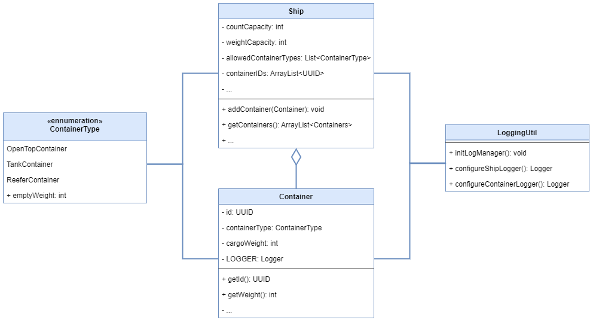

# shipping-container

> This project is part three of my software architecture journey. See my [software-architecture-journey](https://github.com/mykingdomforapawn/software-architecture-journey) repository for more details.

This project lets the user experiment with a simple shipping container scenario and the logs generated by the application. By changing parameters at the ship and the container level and then adding containers to the ship, different log messages can be triggered and reviewed afterwards. 

---

## Table of contents:
- [Why? - How? - What?](#why---how---what)
- [Class diagram](#class-diagram)

---

## Why? - How? - What?

To extend my knowledge of the Java programming language fundamentals I wanted to try out a few more concepts. This project was set up to play around with some logging features. On the way I was able to try out some other features of the programming language as well.

- Loggers, Log property files, LogManager, ...
- Exceptions
- Enumerations with attached properties
- Universally Unique Identifiers (uuid)

## Class diagram

